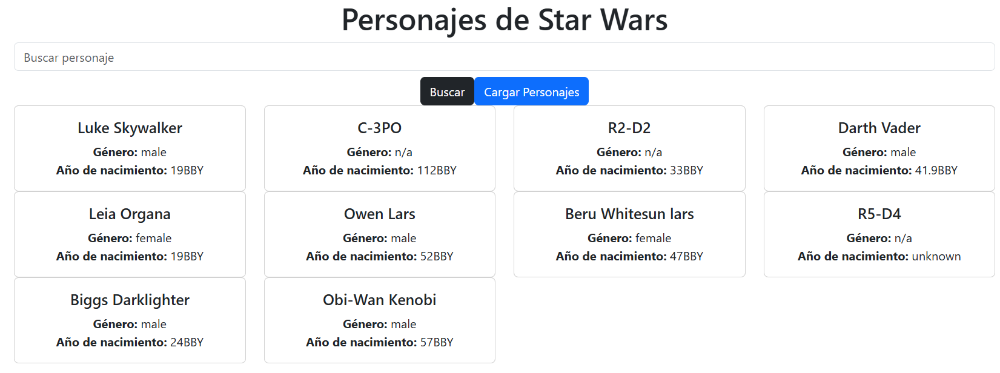

# Star Wars Characters App

This is a **basic React app** built with **Create React App** that fetches and displays **Star Wars characters** using the [SWAPI](https://swapi.dev/) API.

## 🚀 Features
- Fetches character data from the Star Wars API.
- Displays a list of characters with basic information.
- Simple and clean UI with React components.

## 🛠 Tech Stack
- **React** (Create React App)
- **Fetch API / Axios** (for data retrieval)
- **CSS** (for basic styling)

## 📦 Installation
### **1️⃣ Clone the repository**
```sh
git clone https://github.com/your-username/react-starwars-app.git
cd react-starwars-app
```

### **2️⃣ Install dependencies**
```sh
npm install
```

### **3️⃣ Start the app**
```sh
npm start
```
The app will be available at `http://localhost:3000`.

## 📸 Preview
<!-- Add your images here -->

